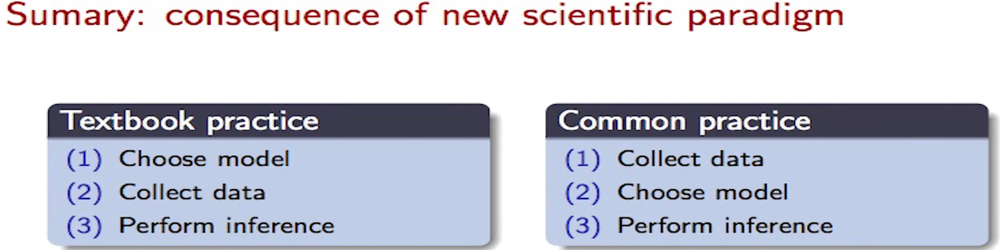

# `README.md` for [data](https://github.com/Yukino-Ai/data)

---

The current purpose of this repo is to collect data (mainly spreadsheets) in order to analyze it later.

🍅 image source:  
[🎥 Emmanuel Candés | Research in the Big Data Era](https://www.youtube.com/watch?v=aT06nHoo2o0&t=32m33s)
